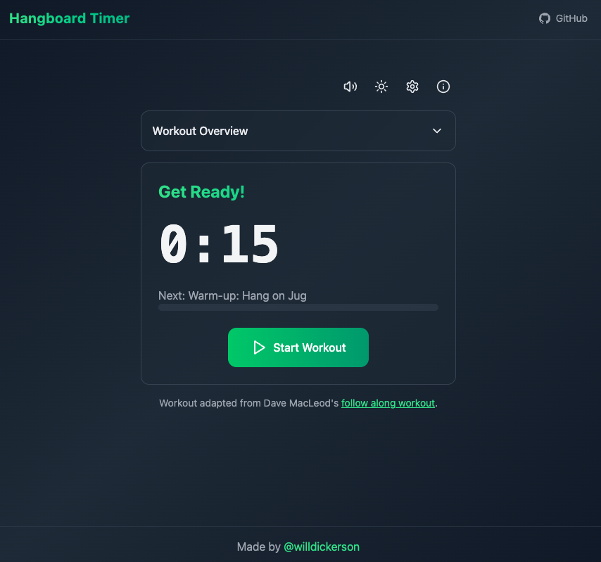

# Hangboard Timer

[](https://codecov.io/gh/willdickerson/hangboard-timer)

A simple hangboard workout timer built with **React** and **Vite**. This app uses **Tailwind CSS** for styling.



**Try it here:** [Hangboard Timer](https://www.hangboard.net/)

## Features

- **Workout Timer** – Step-by-step intervals for warm-up and main sets.
- **Progress Preview** – Easily see all upcoming steps.
- **Sound Effects** – Audio cues to guide your workout (mute option included).

## Getting Started

1. **Clone the repository** (or download the source):
   ```bash
   git clone https://github.com/willdickerson/hangboard-timer.git
   cd hangboard-timer
   ```

2. **Install Dependencies**:
   ```bash
   npm install
   ```
   
3. **Start Development Server**:
   ```bash
   npm run dev
   ```
   - This will start the local development server.  
   - Open your browser and navigate to the URL shown in the terminal (e.g., `http://localhost:5173`).

4. **Build for Production**:
   ```bash
   npm run build
   ```
   - This creates a production-ready `dist/` folder with your bundled app.

5. **Preview Production Build**:
   ```bash
   npm run preview
   ```
   - Serves your built project locally for final testing.

## Contributing

Contributions are welcome! Feel free to open an [issue](https://github.com/willdickerson/hangboard-timer/issues) or submit a pull request.

## License

This project is open-source under the [MIT License](LICENSE).